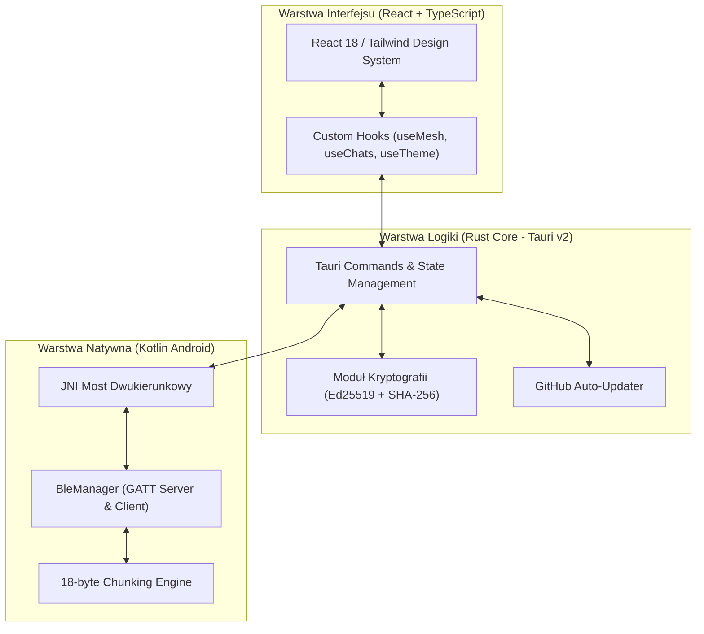

# VOID 🌌

> **Zdecentralizowana, szyfrowana sieć komunikacyjna Mesh oparta na technologii Bluetooth Low Energy (BLE). Komunikacja bez dostępu do Internetu, Wi-Fi oraz sieci komórkowych.**

---

## ⚡ O Projekcie

**VOID** to zoptymalizowana aplikacja mobilna stworzona w oparciu o **Tauri v2**, **Rust** oraz **Kotlin (Android Native BLE)**, umożliwiająca bezpieczną komunikację P2P (Peer-to-Peer) w warunkach braku infrastruktury sieciowej (off-grid). 

Aplikacja automatycznie wykrywa węzły w zasięgu fali radiowej Bluetooth, buduje dynamiczną siatkę Mesh i przekazuje wiadomości pomiędzy urządzeniami z pełnym szyfrowaniem End-to-End (E2EE).

---

## 🌟 Główne Cechy Architektoniczne

* 🔒 **Szyfrowanie End-to-End (E2EE):** Każda wiadomość jest szyfrowana kluczami kryptograficznymi Ed25519 / X25519 przed wysłaniem w eter.
* 🆔 **Deterministyczne ID Węzła:** Identyfikator węzła (`Node ID`) jest obliczany deterministycznie z klucza publicznego (SHA-256), co gwarantuje stałą tożsamość urządzenia bez zmiennych identyfikatorów sesji.
* 📡 **18-bajtowy Protokół Chunkowania (MTU Agnostic):** Automatyczna fragmentacja i rejestracja bufora odbiorczego (`rxBuffers`) zapobiega utracie pakietów na ograniczeniach sprzętowych MTU w starszych i nowszych modułach BLE.
* 📲 **Wsparcie dla Android 13+ (API 33+):** Pełna zgodność z nowoczesnym API Android GATT (`writeCharacteristic` & `writeDescriptor`).
* 🚨 **System Radarowy SOS:** Sygnał alarmowy propagowany przeskokowo w całej sieci Mesh z dynamicznym wyliczaniem dystansu i kierunku.
* 🔄 **Automatyczne Aktualizacje OTA:** Zintegrowana obsługa aktualizacji z poziomu aplikacji pobierająca najnowsze wydania instalatorów APK z GitHub Releases.

---

## 📐 Architektura Systemu



---

## 🔄 Protokół Fragmentacji BLE (18-byte Framing)

Aby zapewnić nieprzerwaną transmisję długich wiadomości tekstowych oraz kluczy szyfrujących bez zależności od negocjacji MTU warstwy fizycznej, zastosowaliśmy ramkę 4-bajtowego nagłówka:

```
+-------------------+-------------------+-------------------+-------------------+------------------------+
| 1B: Header (0x01) | 1B: Message ID    | 1B: Total Chunks  | 1B: Chunk Index   | Max 18B: Payload Data  |
+-------------------+-------------------+-------------------+-------------------+------------------------+
```

---

## 🚀 Automatyczny Proces Wydawania Wersji (CI/CD)

W projekcie skonfigurowano **GitHub Actions** (`.github/workflows/release.yml`), które automatycznie buduje zoptymalizowane pod procesory `AArch64` pliki `.apk` przy każdym nowym tagu wersji.

### Wydanie Nowej Wersji w 3 Krokach:

1. **Zwiększ wersję** w plikach `package.json` oraz `src-tauri/tauri.conf.json` (np. na `0.0.2`).
2. **Commit & Push** zmian do gałęzi `main`.
3. **Stwórz i wyślij Tag:**
   ```bash
   git tag v0.0.2
   git push origin v0.0.2
   ```

W ciągu kilku minut GitHub Actions zbuduje instalator `Void.apk` i opublikuje go w zakładce **Releases**. Urządzenia z zainstalowaną aplikacją automatycznie wyświetlą banner z prośbą o aktualizację.

---

## 🛠️ Budowanie Lokalne

### Wymagania:
* Node.js v20+
* Rust (wersja stable z docelowymi architekturami androida)
* Android SDK & NDK (v27)

### Komendy:
```bash
# Instalacja zależności
npm install

# Kompilacja warstwy Frontendowej
npm run build

# Budowanie pakietu Android APK
npm run tauri android build -- --target aarch64
```

---

## 📄 Licencja

Projekt objęty licencją **MIT**.
